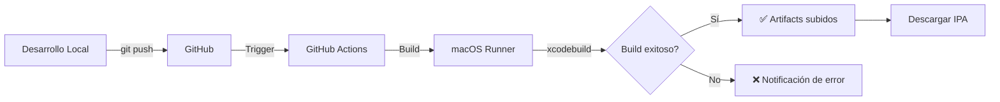

# 🚀 GitHub Actions - iOS Build Setup

## ¿Qué se incluye?

Este proyecto está configurado con dos workflows de GitHub Actions:

### 1. **Build Workflow** (`.github/workflows/build.yml`)
- ✅ Compila la app en cada push
- ✅ Genera un archive (.xcarchive)
- ✅ Genera un IPA (si está configurado)
- ✅ Sube los artefactos

### 2. **Tests Workflow** (`.github/workflows/tests.yml`)
- ✅ Ejecuta tests unitarios
- ✅ Recolecta coverage
- ✅ Integración con Codecov

---

## 📋 Requisitos Previos

### 1. Crear proyecto Xcode

**⚠️ IMPORTANTE**: Primero debes crear el proyecto `.xcodeproj` en Xcode:

```bash
# En macOS, abre Xcode e importa el proyecto
open iOSAppDriver.xcodeproj
```

O crea uno nuevo:
```bash
# Crear proyecto usando xcodebuild
xcodebuild -version
```

### 2. Configurar Scheme

En Xcode:
1. Product → Scheme → Manage Schemes
2. Asegúrate que `iOSAppDriver` está compartido (Shared checkbox)
3. Product → Build Phases - Verifica que los archivos Swift están incluidos

### 3. Configurar Signing

```bash
# Ver Team ID
security find-identity -v -p codesigning

# Actualizar exportOptions.plist con tu Team ID
```

---

## 🔧 Pasos de Configuración

### Paso 1: Push al Repositorio

```bash
cd /home/kmz/Proyectos/ios/iOSAppDriver

# Configurar git (si no está hecho)
git config user.name "Tu Nombre"
git config user.email "tu.email@example.com"

# Agregar todos los archivos
git add .

# Commit
git commit -m "🎉 Initial iOS project with GitHub Actions"

# Push (cambiar 'main' si tu rama es diferente)
git push origin main
```

### Paso 2: Habilitar GitHub Actions

1. Ve a tu repositorio en GitHub
2. **Settings** → **Actions** → **General**
3. Selecciona: "Allow all actions and reusable workflows"
4. Click Save

### Paso 3: Verificar Workflows

1. Ve a la pestaña **Actions** en GitHub
2. Verifica que los workflows están corriendo:
   - 🍎 Build iOS App
   - 🧪 Tests & Code Coverage

---

## 🎯 Configuración de Signing (Importante)

Para que el build funcione completamente:

### Opción 1: Automatic Signing (Recomendado para CI/CD)

```bash
# En tu Mac, ejecuta una vez en Xcode:
# 1. Product > Destination > iOS Simulator
# 2. Product > Build (Cmd+B)
# 3. Esto genera el certificado automático
```

### Opción 2: Manual Signing

```bash
# Crear certificado
security find-identity -v -p codesigning

# Actualizar exportOptions.plist
nano exportOptions.plist
```

Edita `exportOptions.plist`:
```xml
<key>teamID</key>
<string>YOUR_TEAM_ID_HERE</string>
```

---

## 📱 Compilar Proyecto Xcode

Antes de hacer push, asegúrate que el proyecto compila localmente:

```bash
# Listar schemes disponibles
xcodebuild -showBuildSettings -scheme iOSAppDriver

# Build para simulador
xcodebuild -scheme iOSAppDriver \
  -configuration Debug \
  -sdk iphonesimulator \
  -derivedDataPath build

# Build para dispositivo
xcodebuild -scheme iOSAppDriver \
  -configuration Release \
  -sdk iphoneos \
  build
```

---

## 🔄 Workflow de Desarrollo



---

## 📊 Ver Resultados del Build

### En GitHub:

1. Ve a **Actions**
2. Selecciona el workflow (`Build iOS App`)
3. Haz click en el último run
4. Expande **Build iOS App** para ver logs
5. Al final, `Artifacts` muestra los archivos generados

### Descargar IPA:

```bash
# Desde GitHub UI:
1. Actions > Build iOS App > Latest run
2. Artifacts > build-output
3. Download ZIP

# O desde terminal:
gh run download <run-id> -n build-output
```

---

## 🐛 Solucionar Problemas

### Error: "Scheme not found"

```bash
# Solución: Crear scheme compartido
xcodebuild -list
```

Si no aparece `iOSAppDriver`, crea uno en Xcode:
- Product → Scheme → New Scheme
- Name: `iOSAppDriver`
- Checks: ✅ Shared

### Error: "Cannot find resource"

Asegúrate que todos los archivos Swift están en el Xcode project:
1. En Xcode: Project > Target > Build Phases
2. Verify que:
   - `ContentView.swift` está en "Compile Sources"
   - `WebViewContainer.swift` está incluido
   - `iOSAppDriver.swift` está incluido

### Error: "Code signing failed"

1. En Xcode: Signing & Capabilities
2. Select Team: Tu Apple Developer Team
3. Automatic manage signing: ✅ Enabled

### Error: "Pod file not found"

Si usas CocoaPods:
```bash
pod init
pod install
git add Podfile Podfile.lock
git commit -m "Add Podfile"
```

---

## 📈 Monitorear Builds

### Configurar Notificaciones

En GitHub, Settings → Notifications:
- ✅ Notify on failed builds
- ✅ Branch protection enabled

### Agregar Badge

En `README.md`:

```markdown
[](https://github.com/YOUR_USERNAME/iOSAppDriver/actions)
```

---

## 🚢 Publicar en App Store

Para incluir en el workflow:

1. Crear **App Store Connect API Key**
2. Agregar secrets en GitHub:
   - `APPLE_API_KEY`
   - `APPLE_API_ISSUER_ID`
3. Extender workflow con `altool` o `Xcode Cloud`

---

## 📚 Archivos Incluidos

```
.github/workflows/
├── build.yml           # Build principal
└── tests.yml           # Tests y coverage

Archivo de configuración:
├── exportOptions.plist # Opciones de export
└── .gitignore         # Archivos a ignorar
```

---

## ✅ Checklist

- [ ] Crear/actualizar `.xcodeproj` en Xcode
- [ ] Ejecutar build localmente (`Cmd+B`)
- [ ] Verificar scheme es compartido
- [ ] `git push` hecho
- [ ] GitHub Actions habilitado en repo
- [ ] Verificar workflow en Actions tab
- [ ] Descargar artefactos
- [ ] Verificar IPA generado

---

## 🎉 ¡Listo!

Tu app iOS se compila automáticamente en GitHub Actions. Cada `git push` dispara:
- ✅ Compilación
- ✅ Tests
- ✅ Generación de IPA
- ✅ Subida de artefactos

**Happy Building! 🚀**
